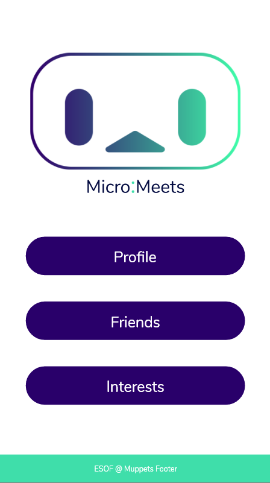
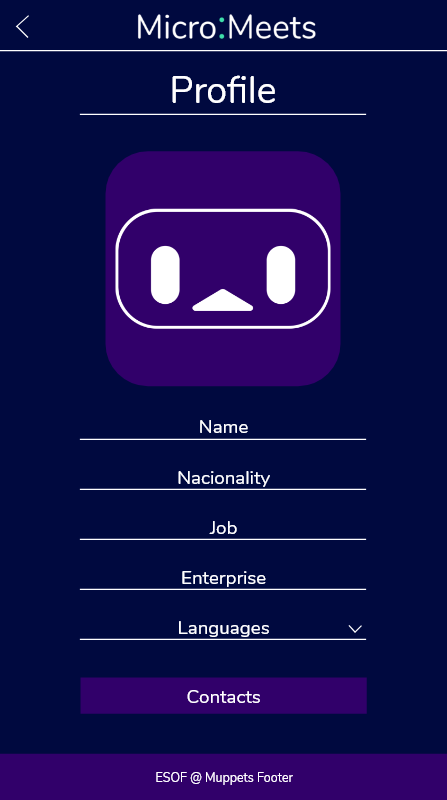
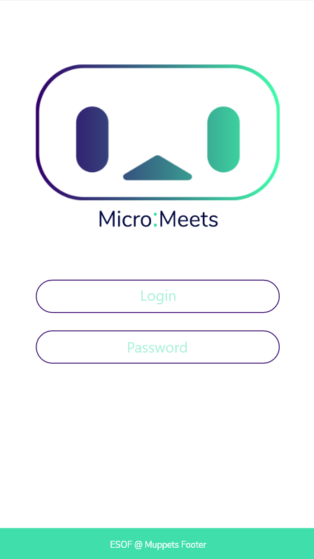
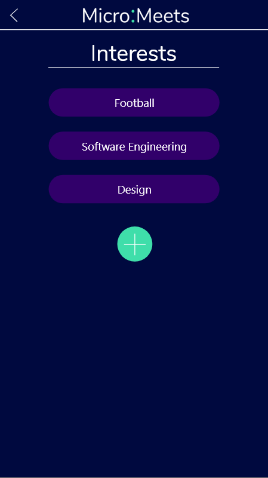
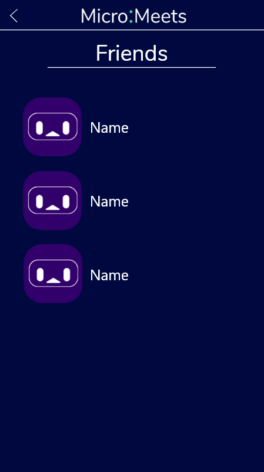

# MicroMeeting
## Overview
MicroMeeting is an Open Source app to improve the colective experience (CX) of participants attending conferences.  
In order to improve such experience our product aims at taking down social barriers and promoting social interaction between participants.  

## Planned Features
This is a work in progress project. Nevertheless, we have some great ideas for our app.  
Here are some examples of what you should be able to do when our product is ready:
* Pair with someone else near you to start a conversation based on mutual interests;
* Exchange personal or professional information seamlessly with a tap of a button;
* Manage your profile information (picture, name, job, etc.) so people can know who you are and what you do;
* Discover a new and funny way to socialize using the [Micro:bit](https://microbit.org/) technology.

## Mockups
Yeah, we have those! And they are gorgeous:  
Start Page:   
Profile Page:   
Login Page:   
Interests Page:   
Friends Page:   

## Development Details
For a better understanding of how we are planning and specifiyng the project needs please check out our in-depth report [here](docs/report.md). If you want to know even more feel free to contact us!

## Technologies
To develop our product we are using:
* [Flutter](https://flutter.dev/), for the app design;
* [Python](https://www.python.org/) and [JavaScript](https://www.javascript.com/), to program the [Micro:bit](https://microbit.org/);
* [Trello](https://trello.com/), to help on task management and team coordination;
* Lots of passion and hard work, to make a great app that will deliver to our expectations.
